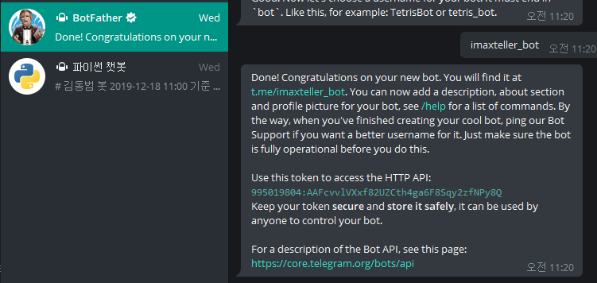
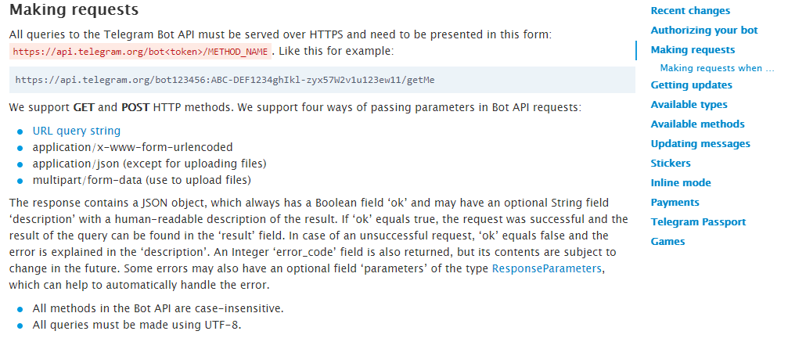
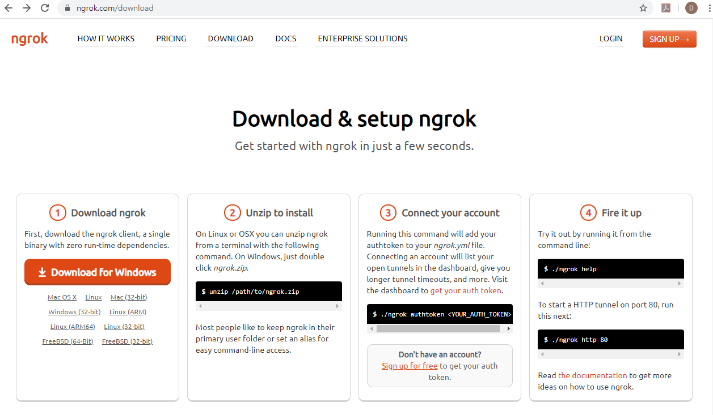
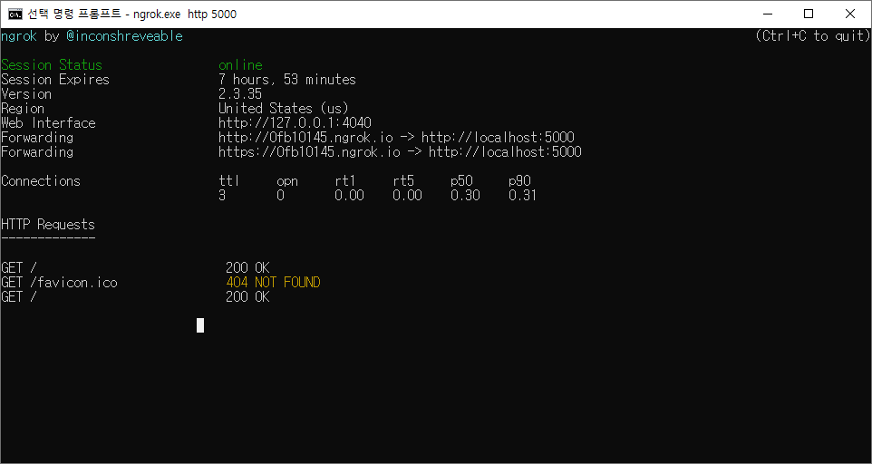
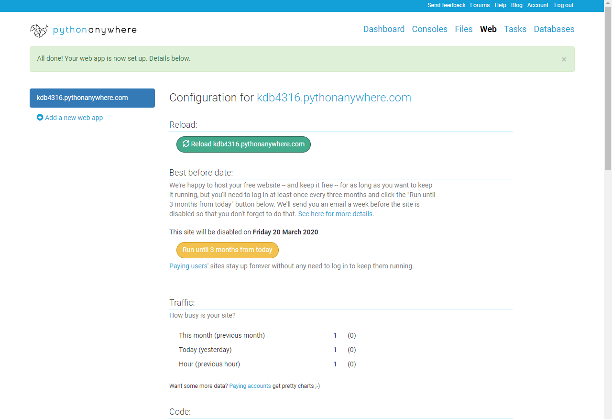
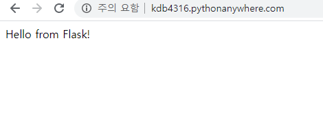
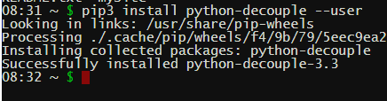

### Flask, Telegram Chatbot, 등 (12/20)

## ngrok

cmd.exe에서

`ngrok.exe http 5000`

치면 생성됨.

https://0fb10145.ngrok.io

이라는 주소가 생성됨

https://core.telegram.org/bots/api#getupdates

https://api.telegram.org/bot995019804:AAFcvvlVXxf82UZCth4ga6F8Sqy2zfNPy8Q/setwebhook?url=https://0fb10145.ngrok.io/chatbot

getupdates

setwebhook

---

Naver 파파고 api

https://github.com/naver/naver-openapi-guide/blob/master/sample/python/APIExamTranslateNMT.py

---

PythonAnywhere

console -> bash -> 들어가서 python-decouple를 깔아주어야 함

https://api.telegram.org/bot995019804:AAFcvvlVXxf82UZCth4ga6F8Sqy2zfNPy8Q/setwebhook?url=kdb4316.pythonanywhere.com/chatbot